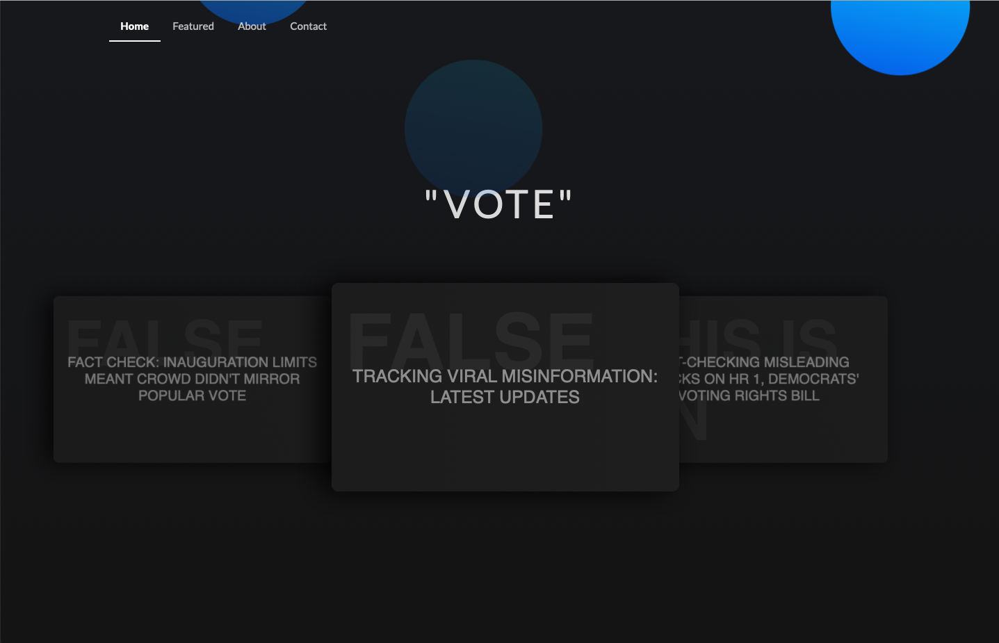
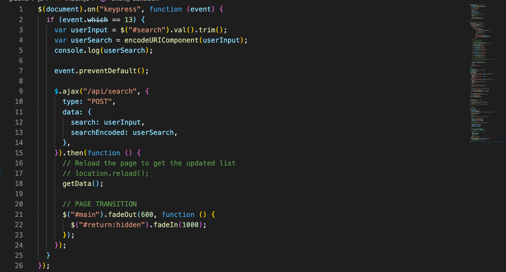
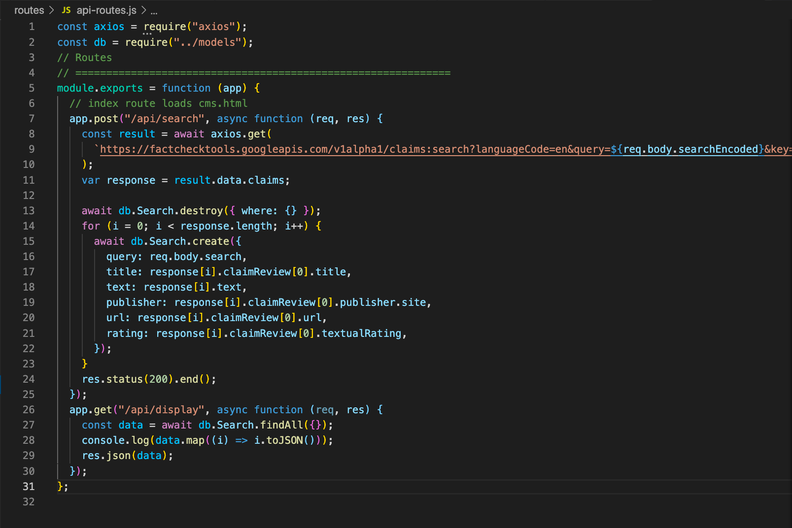
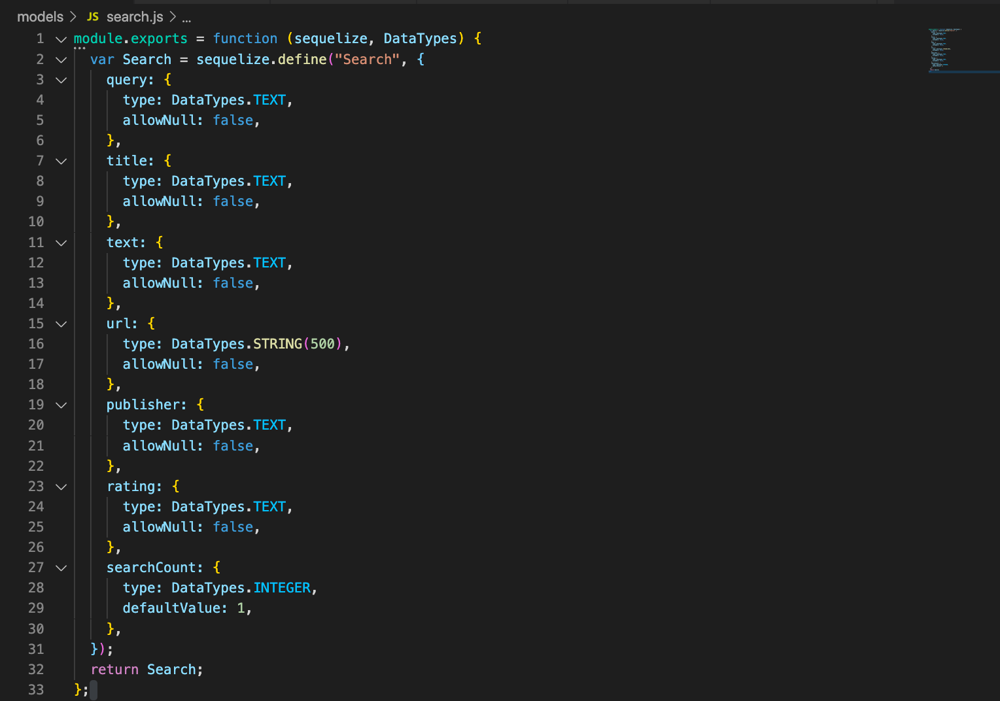

# Fact Checker

## Table of Contents

- [Technology Used](#Technology)
- [Deployed Site](#Deployed)
- [Features](#Features)
- [Other](#Other)
- [Usage](#Usage)
- [Author](Author)
- [License](License)

 

## Deployed Site

[Fact Checker](https://googlefactchecker.herokuapp.com)

 

## Technology Used

- JavaScript
- HTML
- CSS
- [axios](https://www.npmjs.com/package/axios)
- [body-parser](https://www.npmjs.com/package/body-parser)
- [express.js](https://expressjs.com/)
- [jQuery](https://jquery.com/)
- [mysql](https://www.mysqltutorial.org/)
- [node.js](https://www.npmjs.com/)
- [sequelize](https://github.com/sequelize/sequelize/)
- [Semantic UI](https://semantic-ui.com/)
- [Google Fact Check API](https://developers.google.com/fact-check/tools/api)

 

## Features

### Search

An application that allows you to search claims, terms and quotes, and returns fact checked articles reguarding the validitiy of the query.

_WHY_

In the current poilitcal climate, people are more divided than ever. Distrust in the media has led to a departure from truth, and unfavorable facts are labeled as "fake news." After the 2016 presidential election in the United States, it was uncovered that foreign entities had manipulated democracy through mass disinformation campaigns on social media, and successfully targeted Americans with false claims. This application was created months before the 2020 presidential election, with the hopes that it would safeguard democracy, and create a well enformed electorate.

_HOW_

Using Google's "fact check" API, I created a user friendly interface that allows users to easily enter claims and recieve their articles. We used database archetecture with MySQL to save claims, with hopes of using the most-searched-for claims in a featured secton. The application was designed and developed using HTML, CSS and Javascript's JQuery. 

 [API](https://developers.google.com/fact-check/tools/api).

### **2. User Experience**

Creating a seamless user experience was my top priority. I tried to keep a minimalist aesthetic with aesthetic transitions to seamlessly move the user from one action to another.

### **4. Routes**

Search queries are recieved in the public directory, and passed into the api-routes.js file where the API is called, using axios.js, with the query name. All data is passed using express.js.

_RECIEVED IN PUBLIC_

_API-ROUTES_

From here, the data is passed into the models file, where it is prepped for the mySQL database. Once written to the database, api-routes reads the database for the values that were just passed in, and returned to the public folder for creation of HTML elements.

### **5. Models**

Using express.js, and sequelize.js I created models for each type of data returned, so I could create HTML elements in Javascript with each specific data type.

_MODELS_

Data from the API is passed into the models file from api-routes, using express.js. From there, they are stored in the MySQL database using Sequelize.

## Other

**Future Ambitions**

I hope to use my knowladge of React and React Native to create a mobile application, and hopefully implement different social media api's to crossreference the claims posted with the fact check API.

**Takeaway**

_Aaron_: "If somebody takes something from you, restart and make it better."

## Usage

Click the deployed link.

## Author

Aaron Diggdon

- [LinkedIn](https://www.linkedin.com/in/aarondiggdon/)

- [Github](https://github.com/aarondig)

- [Portfolio](https://aarondig.github.io/aaronDiggdon/)

## License

[MIT](https://choosealicense.com/licenses/mit/)
