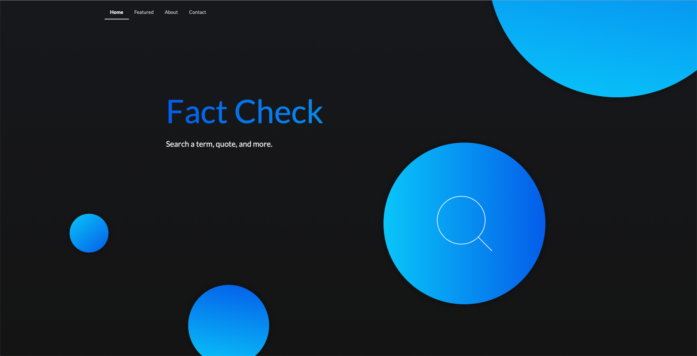

# Fact Checker

## Table of Contents

- [Technology Used](#Technology)
- [Deployed Site](#Deployed)
- [Features](#Features)
- [Other](#Other)
- [Usage](#Usage)
- [Author](Author)
- [Credits](Credits)
- [License](License)

 

## Deployed Site

[Fact Checker](https://what-the-fact.herokuapp.com/)

 

## Technology Used

- JavaScript
- HTML
- CSS
- [axios](https://www.npmjs.com/package/axios)
- [body-parser](https://www.npmjs.com/package/body-parser)
- [express.js](https://expressjs.com/)
- [jQuery](https://jquery.com/)
- [mysql](https://www.mysqltutorial.org/)
- [node.js](https://www.npmjs.com/)
- [sequelize](https://github.com/sequelize/sequelize/)
- [Semantic UI](https://semantic-ui.com/)
- [Google Fact Check API](https://developers.google.com/fact-check/tools/api)

 

## Features

### Search

_What?_

A search that allows you not to simply search terms, but identify claims associated with terms and rates whether they are true or not.

_Why?_

Even if you are smart, even if you are aware of the daily news and consider yourself a critical thinker, on occasion, something will slip by you. Some little tidbit, some little piece of something will weasel itself into your brain and you will "KNOW" it, you will share it, you will argue for it and you will convince your friends and family member that this is the truth. That this is the fact. So, we wanted to help create a better tool, an easy one to use that will allow you to stop the misinformation and maybe, will help you exclaim "what the fact!?!?!"

_How?_

The claim search is primarily done using google's fact checker [API](https://developers.google.com/fact-check/tools/api).

-------Description of the API Goes Here--------

The biggest challenge using this API was figuring out where to call it and getting it to display on English results (as our site is only in English). In order to resolve our language issue we inserted a bit of code into the original API code that set the language to en

### **2. User Friendly Search Returns**

_What?_

_Why?_

One of the most important points we all agreed on early in the build of this project was that we wanted to create something beautiful and easy to use. Being able to easily select the claim and have it show up nicely was paramount.

_How?_

### **4. Saved Searches**

_What?_

_Why?_

_How?_

### **5. Model View Control Design**

_What?_

_Why?_

_How?_

## Other

**For later builds**

twitter fact check -reads through tweets and uses response to enter into the fact check api
Comments section
Icons/images that show up with claims

**Takeaway**

_Aaron_: "If somebody takes something from you, restart and make it better."

## Usage

###

## Author

Aaron Diggdon

- [linkedin] (https://www.linkedin.com/in/rachael-kelm-southworth-87a3831b3)

- [github] (https://github.com/aarondig)

- [portfolio](https://rksouth.github.io/responsive_portfolio/)

## Credits

I would like to thank me myself and I for perserviering through mutual conflict, hasty judgement, and lack of understanding to adapt to the circumstances, and create something I'm truly proud of.

## License

[MIT](https://choosealicense.com/licenses/mit/)
